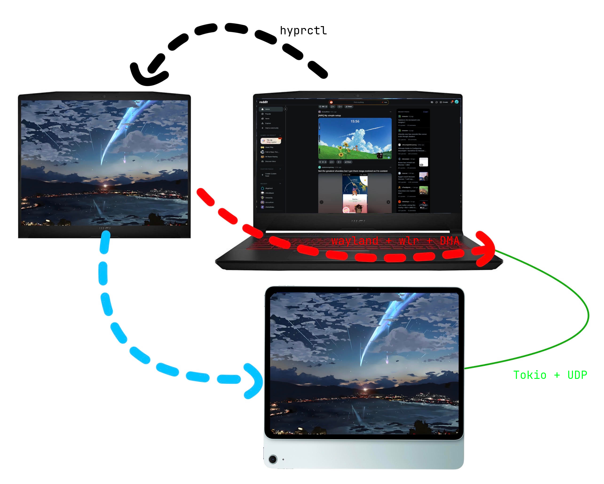

# Hyprpad: High-Performance Wayland Display Extension

**Hyprpad** is a Linux-native utility that turns a tablet (iPad/Android) into a second monitor for Hyprland users. Instead of traditional, slow screen-capture methods, Hyprpad utilizes direct hardware-pipeline integration to establish an extremely low-latency stream over UDP.

## Architecture & Concept

Hyprpad is designed for maximum efficiency by applying "zero-copy" principles. We create a virtual monitor in Hyprland, capture the frames via the `wlr-screencopy` protocol, and stream them directly to the client using hardware-accelerated encoding.

### The Data Pipeline

The stream leaves the CPU as little as possible, ensuring a monitor experience that feels like a physical display:

## Technical Stack

### Host (Linux / Hyprland)

- **Language:** Rust
- **Compositor Interface:** `wayland-client` + `wlr-screencopy-unstable-v1`
- **Encoding:** `ffmpeg-next` (via FFmpeg C-libraries with hardware acceleration)
- **Networking:** `tokio` + `rtp-rs` (for real-time transport)
- **GUI:** `eframe` / `egui` (GPU-accelerated interface)

### Client (iPad / Android)

- **Transport:** `Network.framework` (UDP/RTP)
- **Decoding:** `VideoToolbox` (Apple) / `MediaCodec` (Android)
- **Rendering:** Metal / OpenGL

## Development Plan

### Phase 1: Virtual Monitor Integration

Setting up the workspace. We use Hyprland IPC to create a headless monitor that runs out of sight of the main user.

- _Goal:_ Hyprland must "believe" an external display is connected.
- _Technology:_ `hyprctl` or the `hyprland` Rust crate.

### Phase 2: Zero-Copy Capture & Streaming

The core of performance. We avoid copying pixel data to the CPU.

- _Capture:_ Retrieve DMA-BUF file descriptors via `wlr-screencopy`.
- _Encoding:_ Feed the DMA-BUF directly to the GPU encoder (VAAPI/NVENC) via FFmpeg.
- _Why UDP?_ For a secondary monitor, latency is more critical than packet integrity. If a frame is lost (UDP), we recover at the next I-frame instead of making the entire stream wait for TCP retransmissions.

### Phase 3: Native Control Panel

A fast, native GUI to manage the stream and settings live.

- Status indicators (Bitrate, FPS, Network Jitter).
- Configuration (Resolution, Refresh rate, Encoding presets).
- Direct connection to the capture thread via `Arc<Mutex<Config>>` or channels.

### Phase 4: Client Implementation

Building the receiver app that correctly reassembles RTP packets and renders them with hardware acceleration on the tablet.

## Why UDP & RTP?

For a second-monitor experience, `MP4` (file-based) is unsuitable because the metadata container (moov atom) is only written at the very end of recording.

- **RTP (Real-time Transport Protocol):** This allows us to send chunks of H.264 data that the client can decode immediately without waiting for a complete file.
- **UDP:** Ensures packets are delivered as fast as possible without the overhead of TCP handshakes and retransmissions, which is essential to minimize input lag on your tablet.

## Roadmap & Status

- [x] **Phase 1:** Headless virtual monitor setup & IPC management.
- [ ] **Phase 2:** Wayland screencopy implementation (DMA-BUF).
- [ ] **Phase 2:** Hardware encoding pipeline (VAAPI/NVENC).
- [ ] **Phase 3:** UI framework (Egui) & configuration management.
- [ ] **Phase 4:** Client-side (Swift/Kotlin) RTP receiver development.

---
